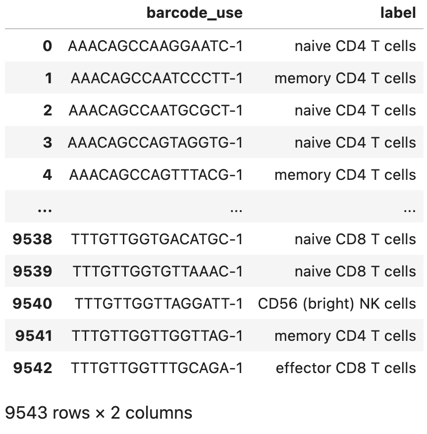
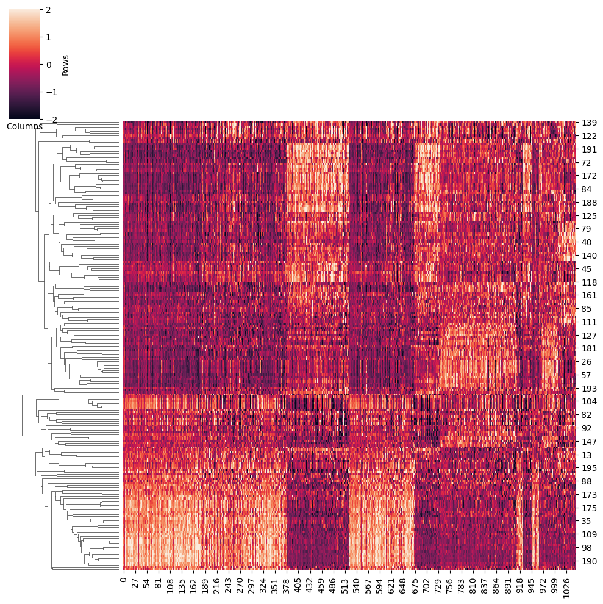
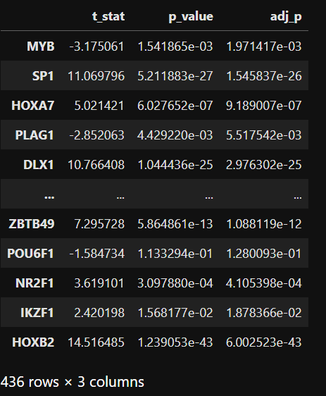
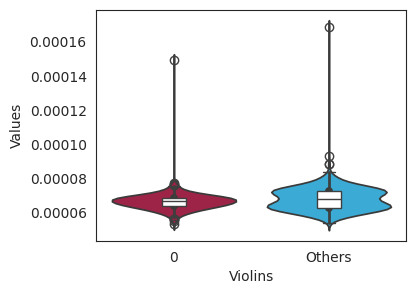
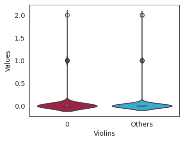

# 前言

LINGER（LIfelong neural Network for GEne Regulation，即终生基因调控神经网络）是一种新颖的方法，用于从单细胞多组学数据中推断基因调控网络（GRN），该方法是在PyTorch之上构建的。
LINGER结合了两个方面：1）跨多种细胞环境的大规模外部批量数据；2）转录因子（TF）基序与顺式调控元件匹配的知识，作为流形正则化，以应对GRN推断中数据有限和参数空间广阔的挑战。

# PBMCs 教程
## 引言
本教程阐述了一种从单细胞多组学数据构建基因调控网络（GRN）的计算框架。我们提供了两种方法： '**baseline**' 和 '**LINGER**'. 第一种是一种简单的方法，结合了先前的基因调控网络（GRN）和单细胞数据中的特征，提供了一种快速的方法。LINGER则是整合了来自外部批量数据的全面基因调控概况。如下图所示，LINGER采用了基于神经网络（NN）模型的终生机器学习（持续学习）技术，这种技术已被证明能够利用在先前任务中学到的知识，帮助更好地学习新任务。

<div style="text-align: right">
  
</div>

在为细胞群体构建基因调控网络（GRN）之后，我们使用特征工程方法推断出特定细胞类型的GRN。正如下图所示，我们结合了单细胞数据（图中的 $O, E$ 和 $C$）以及先前的基因调控网络结构和参数 $\alpha, \beta, d, B$ 和 $\gamma$。


## 下载通用GRN
我们提供了通用基因调控网络，请先下载数据。
```sh
Datadir=/path/to/LINGER/# the directory to store the data please use the absolute directory. Example: Datadir=/zfs/durenlab/palmetto/Kaya/SC_NET/code/github/combine/data/
mkdir $Datadir
cd $Datadir
wget --load-cookies /tmp/cookies.txt "https://drive.usercontent.google.com/download?export=download&confirm=$(wget --quiet --save-cookies /tmp/cookies.txt --keep-session-cookies --no-check-certificate 'https://drive.usercontent.google.com/download?id=1lAlzjU5BYbpbr4RHMlAGDOh9KWdCMQpS'  -O- | sed -rn 's/.*confirm=([0-9A-Za-z_]+).*/\1\n/p')&id=1lAlzjU5BYbpbr4RHMlAGDOh9KWdCMQpS" -O data_bulk.tar.gz && rm -rf /tmp/cookies.txt
```
然后解压缩
```sh
tar -xzf data_bulk.tar.gz
```

## 准备输入数据
输入数据是来自10x sc-multiome数据的特征矩阵和细胞注释/细胞类型标签，其中包括：

- 包括 matrix.mtx.gz、features.tsv.gz 和 barcodes.tsv.gz 的单细胞多组数据。
- 如果您需要细胞类型特定的基因调控网络（例如我们示例中的 PBMC_label.txt），则还包括细胞注释/细胞类型标签。
<div style="text-align: right">
  
</div>  

如果输入数据是来自Scanpy的10X h5文件或h5ad文件，请按照 [h5/h5ad文件作为输入](https://github.com/Durenlab/LINGER/blob/main/docs/h5_input.md) 中的说明进行操作。

### 单细胞数据
我们使用shell命令行下载单细胞数据：
```sh
mkdir -p data
wget -O data/pbmc_granulocyte_sorted_10k_filtered_feature_bc_matrix.tar.gz https://cf.10xgenomics.com/samples/cell-arc/2.0.0/pbmc_granulocyte_sorted_10k/pbmc_granulocyte_sorted_10k_filtered_feature_bc_matrix.tar.gz
tar -xzvf data/pbmc_granulocyte_sorted_10k_filtered_feature_bc_matrix.tar.gz
mv filtered_feature_bc_matrix data/
gzip -d data/filtered_feature_bc_matrix/*
```
示例教程提供了单细胞注释：
```sh
wget --load-cookies /tmp/cookies.txt "https://docs.google.com/uc?export=download&confirm=$(wget --quiet --save-cookies /tmp/cookies.txt --keep-session-cookies --no-check-certificate 'https://docs.google.com/uc?export=download&id=17PXkQJr8fk0h90dCkTi3RGPmFNtDqHO_' -O- | sed -rn 's/.*confirm=([0-9A-Za-z_]+).*/\1\n/p')&id=17PXkQJr8fk0h90dCkTi3RGPmFNtDqHO_" -O PBMC_label.txt && rm -rf /tmp/cookies.txt
mv PBMC_label.txt data/
```
## LINGER 
### 安装
```sh
conda create -n LINGER python==3.10.0
conda activate LINGER
pip install LingerGRN==1.55
conda install bioconda::bedtools #Requirement
```
For the following step, we run the code in python.
### 环境设置
两种方法。
1. baseline;
```python
method='baseline' # this method is corresponding to bulkNN described in the paper
```
2. LINGER;
```python
method='LINGER'
```
#### 将单细胞多组数据转换为 AnnData 格式

我们将把单细胞多组数据转换为 AnnData 格式，并根据细胞类型标签筛选细胞barcode。
```python
import scanpy as sc
#set some figure parameters for nice display inside jupyternotebooks.
%matplotlib inline
sc.settings.set_figure_params(dpi=80, frameon=False, figsize=(5, 5), facecolor='white')
sc.settings.verbosity = 3  # verbosity: errors (0), warnings (1), info (2), hints (3)
sc.logging.print_header()
#results_file = "scRNA/pbmc10k.h5ad"
import scipy
import pandas as pd
matrix=scipy.io.mmread('data/filtered_feature_bc_matrix/matrix.mtx')
features=pd.read_csv('data/filtered_feature_bc_matrix/features.tsv',sep='\t',header=None)
barcodes=pd.read_csv('data/filtered_feature_bc_matrix/barcodes.tsv',sep='\t',header=None)
label=pd.read_csv('data/PBMC_label.txt',sep='\t',header=0)
from LingerGRN.preprocess import *
adata_RNA,adata_ATAC=get_adata(matrix,features,barcodes,label)# adata_RNA and adata_ATAC are scRNA and scATAC
```
#### 质控
```python
import scanpy as sc
sc.pp.filter_cells(adata_RNA, min_genes=200)
sc.pp.filter_genes(adata_RNA, min_cells=3)
sc.pp.filter_cells(adata_ATAC, min_genes=200)
sc.pp.filter_genes(adata_ATAC, min_cells=3)
selected_barcode=list(set(adata_RNA.obs['barcode'].values)&set(adata_ATAC.obs['barcode'].values))
barcode_idx=pd.DataFrame(range(adata_RNA.shape[0]), index=adata_RNA.obs['barcode'].values)
adata_RNA = adata_RNA[barcode_idx.loc[selected_barcode][0]]
barcode_idx=pd.DataFrame(range(adata_ATAC.shape[0]), index=adata_ATAC.obs['barcode'].values)
adata_ATAC = adata_ATAC[barcode_idx.loc[selected_barcode][0]]
```
#### 生成伪批量RNA测序数据
```python
from LingerGRN.pseudo_bulk import *
samplelist=list(set(adata_ATAC.obs['sample'].values)) # sample is generated from cell barcode 
tempsample=samplelist[0]
TG_pseudobulk=pd.DataFrame([])
RE_pseudobulk=pd.DataFrame([])
singlepseudobulk = (adata_RNA.obs['sample'].unique().shape[0]*adata_RNA.obs['sample'].unique().shape[0]>100)
for tempsample in samplelist:
    adata_RNAtemp=adata_RNA[adata_RNA.obs['sample']==tempsample]
    adata_ATACtemp=adata_ATAC[adata_ATAC.obs['sample']==tempsample]
    TG_pseudobulk_temp,RE_pseudobulk_temp=pseudo_bulk(adata_RNAtemp,adata_ATACtemp,singlepseudobulk)                
    TG_pseudobulk=pd.concat([TG_pseudobulk, TG_pseudobulk_temp], axis=1)
    RE_pseudobulk=pd.concat([RE_pseudobulk, RE_pseudobulk_temp], axis=1)
    RE_pseudobulk[RE_pseudobulk > 100] = 100

import os
if not os.path.exists('data/'):
    os.mkdir('data/')
adata_ATAC.write('data/adata_ATAC.h5ad')
adata_RNA.write('data/adata_RNA.h5ad')
pd.DataFrame(adata_ATAC.var['gene_ids']).to_csv('data/Peaks.txt',header=None,index=None)
TG_pseudobulk.to_csv('data/TG_pseudobulk.tsv')
RE_pseudobulk.to_csv('data/RE_pseudobulk.tsv')
```
### 训练模型
将该区域与GRN重叠。
```python
from LingerGRN.preprocess import *
Datadir='/path/to/LINGER/'# This directory should be the same as Datadir defined in the above 'Download the general gene regulatory network' section
GRNdir=Datadir+'data_bulk/'
genome='hg38'
outdir='/path/to/output/' #output dir
preprocess(TG_pseudobulk,RE_pseudobulk,GRNdir,genome,method,outdir)
```
训练模型
```python
import LingerGRN.LINGER_tr as LINGER_tr
activef='ReLU' # active function chose from 'ReLU','sigmoid','tanh'
LINGER_tr.training(GRNdir,method,outdir,activef)
```


### 细胞群基因调控网络
#### TF结合潜能
输出为 'cell_population_TF_RE_binding.txt'，是一个 TF-RE 结合分数的矩阵。
```python
import LingerGRN.LL_net as LL_net
LL_net.TF_RE_binding(GRNdir,adata_RNA,adata_ATAC,genome,method,outdir)
```

#### *cis*-regulatory network
输出是 'cell_population_cis_regulatory.txt'，有3列：区域、目标基因、顺式调节分数。
```python
LL_net.cis_reg(GRNdir,adata_RNA,adata_ATAC,genome,method,outdir)
```
#### *trans*-regulatory network
输出是 'cell_population_cis_regulatory.txt'，有3列：区域、目标基因、反式调节分数。
```python
LL_net.trans_reg(GRNdir,method,outdir)
```

### 细胞类型调控网络

1. 推断特定细胞的调控网络：

```python
celltype='CD56 (bright) NK cells' #use a string to assign your cell type
```

2. 推断所有：

```python
celltype='all'
```
Please make sure that 'all' is not a cell type in your data.

#### TF结合潜能
输出为 'cell_population_TF_RE_binding_*celltype*.txt'，是一个 TF-RE 结合分数的矩阵。
```python
LL_net.cell_type_specific_TF_RE_binding(GRNdir,adata_RNA,adata_ATAC,genome,celltype,outdir)
```
#### *cis*-regulatory network
输出是 'cell_type_specific_cis_regulatory_{*celltype*}.txt' 有3列：区域、目标基因、顺式调节分数。
```python
LL_net.cell_type_specific_cis_reg(GRNdir,adata_RNA,adata_ATAC,genome,celltype,outdir)
```

#### *trans*-regulatory network
输出是 'cell_type_specific_cis_regulatory_{*celltype*}.txt' 有3列：区域、目标基因、反式调节分数。
```python
LL_net.cell_type_specific_trans_reg(GRNdir,adata_RNA,celltype,outdir)
```
## 通过TF活性鉴定关键调控元件
### 介绍
  
TF 活性，重点关注 TF 蛋白在细胞核中的 DNA 结合组分，是识别驱动调控因子的更可靠指标，而不是 mRNA 或整个蛋白质的表达水平。在这里，我们利用了来自单个个体的单细胞多组数据推断的 LINGER 基因调控网络。假设 GRN 结构在个体间保持一致，我们仅使用基因表达数据估计 TF 活性。通过比较病例和对照之间的 TF 活性，我们识别出了驱动调控因子。

### 准备
我们需要一个 _trans_-调控网络，您可以选择最符合您数据的网络。

1. 如果没有单个细胞可用于推断细胞种群和细胞类型特异的基因调控网络，您可以从各种组织中选择一个基因调控网络。

```python
network = 'general'
```

2. 如果您的基因表达数据与细胞种群基因调控网络匹配，您可以设置：

```python
network = 'cell population'
```

3. 如果您的基因表达数据与特定细胞类型匹配，您可以将网络设置为该细胞类型的名称。

```python
network = 'CD56 (bright) NK cells' # CD56 (bright) NK cells is the name of one cell type
```

### 计算TF活性
输入是基因表达数据，可以是单细胞 RNA 测序数据，也可以是与基因调控网络匹配的其他单细胞或批量 RNA 测序数据。基因表达数据的行是基因，列是样本，值是读数（单细胞）或 FPKM/RPKM（批量）。

```python

Datadir='/zfs/durenlab/palmetto/Kaya/SC_NET/code/github/combine/'# this directory should be the same with Datadir
GRNdir=Datadir+'data_bulk/'
genome='hg38'
from LingerGRN.TF_activity import *
outdir='/zfs/durenlab/palmetto/Kaya/SC_NET/code/github/combine/LINGER/examples/output/' #output dir
import anndata
adata_RNA=anndata.read_h5ad('data/adata_RNA.h5ad')
TF_activity=regulon(outdir,adata_RNA,GRNdir,network,genome)
```
  
将 TF 活性按簇可视化为热图。如果您想要将热图保存到 outdit，请设置 'save=True'。输出为 'heatmap_activity.png'。

```python
save=True
heatmap_cluster(TF_activity,adata_RNA,save,outdir)
```
<div style="text-align: right">
  
</div>

### 鉴定驱动元件
我们使用 t 检验来寻找某个细胞类型的差异性 TFs，以活性为指标。

1. 您可以通过以下方式为基因表达数据分配某个特定细胞类型：

```python
celltype='CD56 (bright) NK cells'
```

2. 或者，您可以获取所有细胞类型的结果。

```python
celltype='all'
```

例如：

```python
celltype='CD56 (bright) NK cells'
t_test_results=master_regulator(TF_activity,adata_RNA,celltype)
t_test_results
```

<div style="text-align: right">
  
</div>

可视化差异活性和表达。您可以比较两种不同的细胞类型，或者将一个细胞类型与其他细胞类型进行比较。如果您想要将箱线图保存到 outdit，请设置 'save=True'。输出将为 'box_plot'_+TFName+'_'+datatype+'_'+celltype1+'_'+celltype2+'.png'。

```python
TFName='ATF1'
datatype='activity'
celltype1='CD56 (bright) NK cells'
celltype2='Others'
save=True
box_comp(TFName,adata_RNA,celltype1,celltype2,datatype,regulon_score,save,outdir)
```

<div style="text-align: right">
  
</div>

对于基因表达数据，箱型图如下：
```python
datatype='expression'
box_comp(TFName,adata_RNA,celltype1,celltype2,datatype,regulon_score,save,outdir)
```

<div style="text-align: right">
  
</div>

## 注意

- 细胞特异性基因调控网络基于细胞种群基因调控网络的输出。
- 如果我们想尝试两种不同的方法选项，我们可以创建两个输出目录。

# 参考文献

[Inferring gene regulatory networks from single-cell multiome data using atlas-scale external data | Nature Biotechnology](https://www.nature.com/articles/s41587-024-02182-7)

