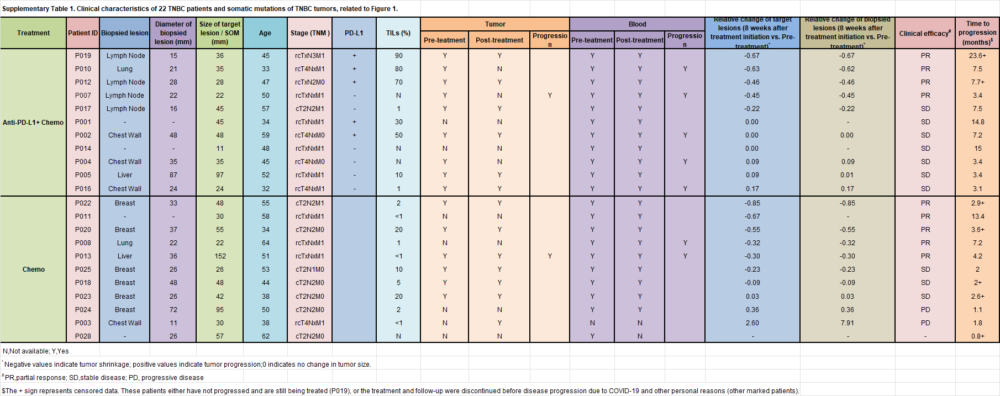

## 写在前面的话
&emsp;&emsp;本系列将基于张泽民团队发表的TNBC免疫图谱进行挖掘（[Single-cell analyses reveal key immune cell subsets associated with response to PD-L1 blockade in triple-negative breast cancer: Cancer Cell](https://www.cell.com/cancer-cell/fulltext/S1535-6108(21)00499-2)），旨在探索原发灶和转移灶免疫微环境的差异及其原因。
&emsp;&emsp;准确严谨的采集和清洗数据是单细胞分析的开始，数据本身的质量和采集过程的规范程度决定了研究结果的可靠性。

## 样本信息
### 患者来源
&emsp;&emsp;国家癌症中心开发的DTHealth TrakCare系统中记录了患者信息，纳入本研究的22名患者满足：（1）组织学确诊晚期TNBC；（2）既往没有化疗、靶向及免疫等全身治疗；（3）研究中接受紫杉醇单药治疗或紫杉醇加阿替利珠单抗治疗。
### 患者信息
1. 本研究所有患者均被诊断为晚期TNBC，大多数患者患有转移性疾病；
2. 事实上，一些患者是接受新辅助治疗的局部晚期患者；
3. 患者为女性，年龄在32-64岁之间，中位值为49岁；

### 样本收集、文库制备和测序
&emsp;&emsp;研究使用16针吸穿刺取乳腺、胸壁肿瘤样本；18号针取淋巴结、肝转移灶样本。测序仪器是10x Genomics公司的HiSeq X Ten，平台为[GPL20795](https://www.ncbi.nlm.nih.gov/geo/query/acc.cgi?acc=GPL20795)。DNA片段被打碎为150bp，进行双端测序。

## 单细胞转录组数据处理
&emsp;&emsp;10x Genomics公司提供的Cell Ranger（V 3.0.1）用于汇总原始数据，过滤低质量读段，将reads与人类参考基因组（GRCh38）比对，分配细胞Barcode，并生成UMI矩阵。值得注意的是，对于10x Genomics公司的测序，由于UMI的存在，使用Raw Count即可反映真实的基因表达，不需要使用标准化方法进行基因定量（[生物信息学笔记（三）：基因定量](https://forrestgump618.github.io/2024/02/16/%E7%94%9F%E7%89%A9%E4%BF%A1%E6%81%AF%E5%AD%A6%E7%AC%94%E8%AE%B0%EF%BC%88%E4%B8%89%EF%BC%89%EF%BC%9A%E5%9F%BA%E5%9B%A0%E5%AE%9A%E9%87%8F/)）。但注意，这里所谓“真实的基因表达”反映的是测序过程中的真实值，即不必考虑测序深度和转录本长度的值；而单细胞测序中，由于转录本的低捕获率，我们假设合格细胞基因表达总量应该类似，所以还要进行标准化排除不同细胞测序质量的差异。
&emsp;&emsp;原文使用Scanpy进行下游分析，质控步骤包括：
1. 过滤在少于10个细胞中表达的基因；
2. 过滤少于200个基因的细胞中检测到的基因；
3. 保留了600-120,000个UMIs、400-8,000个基因和小于10%线粒体基因计数的高质量细胞；
4. 将Scrublet应用于每个测序文库，以去除预期的双峰率为6%的潜在双峰，并滤除doubletScore大于90%分位数的细胞；

&emsp;&emsp;接着，我们进行标准化操作：
2. 标准化每个细胞的总计数（库大小）：这一步是为了消除不同细胞间样本量的差异。库大小通常是指一个细胞中检测到的总UMI数。通过将每个细胞的UMI计数除以该细胞的总UMI计数，可以确保数据在不同细胞间是可比的。
3. 乘以1e6：这一步是为了放大数据，使其更易于处理。通常在生物信息学中，进行这样的转换是为了避免处理极小的数字。
4. 对数据进行对数变换：最后，对标准化后的数据进行对数变换是为了减少数据中极端值的影响，使数据的分布更接近正态分布。这通常有助于后续的统计分析和可视化。

&emsp;&emsp;前面的步骤完成了单细胞转录组数据的质控和标准化，下面进行矩阵降维，进一步排除无关变量的影响，同时压缩分析规模：
1. 选择前4000个可变基因，排除大部分背景基因的影响；
2. 从标准化表达矩阵中去除总计数、线粒体基因计数和热休克蛋白（HSP）相关基因计数的变异，以避免偏差；
3. 主成分分析，把4000个可变基因降为50个主成分；
4. 由此，我们得到了50×细胞数的矩阵，即对于每个细胞有50个变量，使用前2个或者3个主成分进行可视化，通过标注不同样本，发现潜在的批次效应，并通过相应的算法（在R中可以通过Harmony）去除；
5. 由此，我们尽可能避免了因非研究变量因素导致的系统误差，得到新的标准化矩阵。

&emsp;&emsp;最后，Leiden算法寻找细胞簇和分群，UMAP和TSNE进行作图，推荐使用COSG确定Marker。