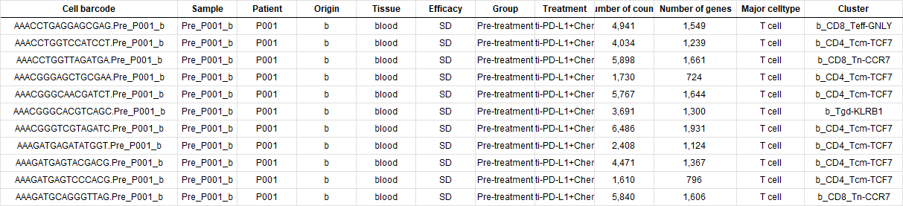

## 载入软件包和设置路径
```r
library(dplyr)
library(Seurat)
library(openxlsx)
library(ggplot2)
library(ggforce)
library(reshape2)
library(RColorBrewer)

setwd("D:/0217workshop")
```

## 读取10X数据和Meta data
```r
original_data =  Read10X(data.dir = "./data/GSE169246/")
meta_info = read.xlsx("./data/meta_info.xlsx")
rownames(meta_info) = meta_info$Cell.barcode
meta_info = meta_info[,-1]
meta_info = filter(meta_info, Tissue %in% c("breast", "liver") & Group == "Pre-treatment")
filter_data = original_data[,rownames(meta_info)]
remove(original_data)
#################### save filter data
```

1. `original_data = Read10X(data.dir = "./data/GSE169246/")`：这行代码从"./data/GSE169246/"目录中读取基因表达数据，使用的函数是Read10X。这是来自10x Genomics的数据。文件目录下有barcodes.tsv.gz；features.tsv.gz和matrix.mtx.gz。这是CellRanger软件生成的，可直接供Seurat读取。
    
2. `meta_info = read.xlsx("./data/meta_info.xlsx")`：这行代码从"./data/meta_info.xlsx"文件中读取元信息，使用的函数是read.xlsx。这个文件可能包含了与每个细胞相关的信息，比如细胞类型、样本来源等。
    
3. `rownames(meta_info) = meta_info$Cell.barcode`：这行代码将meta_info数据框的行名设置为其中一个列（可能是"Cell.barcode"列）的值。这是为了后续方便使用细胞条形码作为索引。
    
4. `meta_info = meta_info[,-1]`：这行代码删除了meta_info数据框中的第一列。因为第一列是细胞条形码，已经作为行名了，不需要再作为数据列。
    
5. `meta_info = filter(meta_info, Tissue %in% c("breast", "liver") & Group == "Pre-treatment")`：这行代码对meta_info数据框进行过滤，只保留肝脏和乳腺在治疗前的数据。
    
6. `filter_data = original_data[,rownames(meta_info)]`：这行代码根据之前过滤后的meta_info数据框，从原始数据中提取出符合条件的数据，存储在filter_data中。
    
7. `remove(original_data)`：这行代码移除了之前加载的original_data对象，可能是为了释放内存空间或者清理不再需要的数据对象。

## 创建Seurat对象、质控和数据变换
```r
mtGenes = grep('^MT-',rownames(filter_data),value=TRUE)
hspGenes = c(grep('^HSP',rownames(filter_data),value=TRUE),
             grep('^HSF',rownames(filter_data),value=TRUE))
gene_list = rownames(filter_data)[!rownames(filter_data) %in% c(mtGenes,hspGenes)]
filter_data = filter_data[gene_list,rownames(meta_info)]
data = CreateSeuratObject(counts = filter_data,min.cells = 10,meta.data = meta_info)

#################save backup for data
data_back_up = data
remove(filter_data)

################# QC
# QC步骤通过meta_info取细胞事实上已经完成，所以不需要重新进行。

data = NormalizeData(data, normalization.method = "LogNormalize", scale.factor = 1e6)
```

这段代码执行了以下操作：

1. **找到线粒体基因：**
    
    - 使用 `grep()` 函数和正则表达式 `'^MT-'` 来匹配 `filter_data` 的行名（基因名），返回以 "MT-" 开头的基因列表。
    - 将结果存储在 `mtGenes` 中。
2. **找到热休克蛋白基因：**
    
    - 使用 `grep()` 函数和正则表达式 `'^HSP'` 和 `'^HSF'` 来匹配 `filter_data` 的行名（基因名），分别返回以 "HSP" 和 "HSF" 开头的基因列表。
    - 将结果存储在 `hspGenes` 中。
3. **创建不包含特定基因的基因列表：**
    
    - 使用 `%in%` 运算符将 `mtGenes` 和 `hspGenes` 合并为一个基因列表。
    - 使用 `!` 运算符取反，以排除这些基因，得到不包含以 "MT-" 开头以及以 "HSP" 或 "HSF" 开头的基因列表。
    - 将结果存储在 `gene_list` 中。
4. **根据基因列表过滤数据：**
    
    - 使用 `filter_data` 和 `rownames()` 函数来根据 `gene_list` 过滤行（基因）。
    - 在此过滤后，只保留了不包含以 "MT-" 开头以及以 "HSP" 或 "HSF" 开头的基因。
5. **使用过滤后的数据创建 Seurat 对象：**
    
    - 使用 `CreateSeuratObject()` 函数创建 Seurat 对象。
    - 提供了过滤后的数据 (`filter_data`) 作为 `counts` 参数，最小细胞数为 10。
    - 提供了元数据 (`meta_info`) 作为 `meta.data` 参数。
    - 使用 `rownames(meta_info)` 选择与 `meta_info` 中行名相对应的行来构建 Seurat 对象。
6. **选择归一化方法：**
    
    - 使用 `NormalizeData()` 函数选择了 "LogNormalize" 方法进行归一化。
    - "LogNormalize" 方法将数据中的每个表达值取对数，通常以自然对数为底（ln），并且可以选择一个缩放因子来控制数据的归一化程度。在这里，设置了 `scale.factor` 参数为 `1e6`，这意味着将每个细胞的总表达值缩放到 1,000,000。这是一种常见的做法，它可以确保每个细胞的总表达值在一个可比较的范围内。

这段代码的目的是根据给定的条件对基因和数据进行过滤，并基于过滤后的数据创建 Seurat 对象，以便后续的单细胞分析。

## 降维

```r
data = ScaleData(data,features = VariableFeatures(data))
data = RunPCA(data,features = VariableFeatures(data))
DimPlot(data, reduction = "pca",group.by = "Tissue")
DimPlot(data, reduction = "pca",group.by = "Sample")
ElbowPlot(data)
data = RunUMAP(data,dims = 1:15)
data = RunTSNE(data,dims = 1:15)
```

1. `data = ScaleData(data, features = VariableFeatures(data))`： 这一行代码调用了一个名为 `ScaleData` 的函数，用于对数据进行缩放或标准化处理，其中 `data` 是输入的数据，而 `VariableFeatures(data)` 则可能是用于确定要进行缩放的特征的函数或方法。
    
2. `data = RunPCA(data, features = VariableFeatures(data))`： 这一行代码调用了一个名为 `RunPCA` 的函数，用于执行主成分分析（PCA）降维操作，以减少数据的维度。同样，`data` 是输入的数据，`VariableFeatures(data)` 用于确定应用 PCA 的特征。
    
3. `DimPlot(data, reduction = "pca", group.by = "Tissue")`： 这一行代码调用了一个名为 `DimPlot` 的函数，用于绘制降维后的数据的可视化图。`reduction = "pca"` 表示使用 PCA 降维后的数据进行可视化，而 `group.by = "Tissue"` 表示根据组织类型来对数据进行分组，并在图上用不同颜色或符号表示不同组织类型的数据点。
    
4. `DimPlot(data, reduction = "pca", group.by = "Sample")`： 类似于上一行，这一行也是调用 `DimPlot` 函数，但是这次是根据样本（Sample）来对数据进行分组，并对数据进行可视化。
    
5. `ElbowPlot(data)`： 这一行代码调用了一个名为 `ElbowPlot` 的函数，用于绘制 PCA 或者其他降维方法中的“肘部图”，帮助确定降维后保留的主要成分数量。
    
6. `data = RunUMAP(data, dims = 1:15)`： 这一行代码调用了一个名为 `RunUMAP` 的函数，用于执行 UMAP（Uniform Manifold Approximation and Projection）算法，将数据降维到更低的维度。`dims = 1:15` 表示在执行 UMAP 时考虑的维度范围。
    
7. `data = RunTSNE(data, dims = 1:15)`： 最后一行代码调用了一个名为 `RunTSNE` 的函数，用于执行 t-SNE（t-distributed Stochastic Neighbor Embedding）算法，也是一种常用的数据降维算法。`dims = 1:15` 表示在执行 t-SNE 时考虑的维度范围。

注意，这里我们先降维，后面再拆分数据，可以保留数据点信息。

## 拆分数据
```r
ser_split = SplitObject(data,split="Tissue")
liver_data = ser_split[["liver"]]
breast_data = ser_split[["breast"]]
```

## 聚类、分群（以肝脏为例）

```r
liver_data = FindNeighbors(liver_data, dims = 1:15)
liver_data = FindClusters(liver_data, resolution = 0.1)
```

1. `liver_data = FindNeighbors(liver_data, dims = 1:15)`： 这一行代码调用了一个名为 `FindNeighbors` 的函数，用于找到数据中每个数据点的邻居。在这里，`liver_data` 是输入的数据，`dims = 1:15` 表示在寻找邻居时考虑的维度范围，通常是降维后的结果。这个过程通常是用于计算数据点之间的相似度或距离，为后续的聚类操作做准备。
    
2. `liver_data = FindClusters(liver_data, resolution = 0.1)`： 这一行代码调用了一个名为 `FindClusters` 的函数，用于在数据中找到聚类。`liver_data` 是输入的数据，`resolution = 0.1` 表示在执行聚类时使用的分辨率参数，它可以影响聚类结果的数量和密度。较低的分辨率可能导致更多的细分聚类，而较高的分辨率可能导致更少但更大的聚类。

```r
my_colors = c("#D2EBC8","#3C77AF","#7DBFA7","#AECDE1",
              "#EE934E","#D1352B","#9B5B33","#F6CFE4",
              "#B383B9","#8FA4AE","#FCED82","#F5D2A8","#BBDD78")
tsne_data = FetchData(liver_data , vars = c("tSNE_1", "tSNE_2", "Major.celltype","seurat_clusters"))
ggplot(tsne_data, aes(x = tSNE_1, y = tSNE_2, color = as.factor(seurat_clusters))) +
  geom_point(size = 1) + 
  scale_color_manual(values = my_colors) +
  theme_minimal() + 
  labs(
    title = "tSNE Plot of Major Cell Types",  # 添加标题
    x = "tSNE Dimension 1",  # 自定义X轴标签
    y = "tSNE Dimension 2",  # 自定义Y轴标签
    color = "Cluster"  # 自定义图例标题
  ) +
  theme(
    legend.position = "right",
    legend.text = element_text(size = 12),  # 增加图例文本的大小
    plot.title = element_text(hjust = 0.5),  # 居中对齐标题
    axis.text = element_text(size = 12),  # 增加轴标签的字体大小
    axis.title = element_text(size = 14),  # 增加轴标题的字体大小
    panel.grid.major = element_blank(),  # 去除主要网格线
    panel.grid.minor = element_blank(),  # 去除次要网格线
    panel.border = element_rect(colour = "black", fill=NA, size=1)  # 增加边框
  )
```
  
这段代码是用来绘制 t-SNE（t-distributed Stochastic Neighbor Embedding）降维后的数据的散点图，并根据聚类结果着色：

1. `my_colors = c("#D2EBC8","#3C77AF", ...)`： 定义了一个包含颜色代码的向量，用于后续的图形着色。
    
2. `tsne_data = FetchData(liver_data , vars = c("tSNE_1", "tSNE_2", "Major.celltype","seurat_clusters"))`： 提取了 liver_data 数据集中 t-SNE 的前两个维度（即 tSNE_1 和 tSNE_2），以及每个数据点的主要细胞类型和 Seurat 聚类结果。
    
3. `ggplot(tsne_data, aes(x = tSNE_1, y = tSNE_2, color = as.factor(seurat_clusters))) +`： 创建了一个基础的 ggplot2 图形对象，设置 x 轴为 tSNE_1、y 轴为 tSNE_2，并根据 seurat_clusters 列进行着色。
    
4. `geom_point(size = 1) +`： 添加了一个散点图层，指定点的大小为 1。
    
5. `scale_color_manual(values = my_colors) +`： 手动指定颜色映射，使用了前面定义的 my_colors 向量。
    
6. `theme_minimal() +`： 使用了一个基本的最小化主题。
    
7. `labs(...)`： 添加了图表的标题和轴标签，并自定义了图例标题。
    
8. `theme(...)`： 进一步调整了图表的主题，包括图例位置、文本大小、标题对齐方式、轴标签大小、网格线和面板边框。


COSGR包是一款专门用于单细胞测序数据中准确和超快速标记基因识别的工具。它可以应用于不同类型的数据，包括单细胞RNA测序、单细胞ATAC测序和空间转录组学。COSGR包的核心是其COSG函数，该函数利用余弦相似性来识别具有更高准确性和可扩展性的标记基因。这种方法对大规模数据集特别有效，能够在不到两分钟的时间内识别出一百万个细胞的标记基因。

```r
library(COSG)
marker_cosg = cosg(
  liver_data,
  groups='all',
  assay='RNA',
  slot='data',
  mu=1,
  n_genes_user=200)
write.xlsx(marker_cosg$names,"./liver_marker.xlsx")
```

代码解释

1. `library(COSG)`: 在R会话中加载COSGR包。
    
2. `marker_cosg = cosg(...)`: 这行代码调用了`cosg`函数，应用于一个数据集（`liver_data`）。指定的参数包括：
    
    - `groups='all'`: 分析数据集中的所有细胞群组。
    - `assay='RNA'`: 指定要使用的检测数据类型。
    - `slot='data'`: 表明使用检测数据的哪个部分。
    - `mu=1`: 设置`mu`参数，这影响识别标记基因的特异性。
    - `n_genes_user=200`: 在分析中考虑的基因数量。
3. `write.xlsx(marker_cosg$names,"./liver_marker.xlsx")`: 这行代码将`marker_cosg`对象中识别的标记基因名称保存到名为"liver_marker.xlsx"的Excel文件中。
    

在`cosg`函数中，可以调整`mu`参数来识别更具体的标记基因。将`mu`设置为更高的值，如10或100，可以提高特异性。此外，可以将`remove_lowly_expressed`设置为`TRUE`，以排除目标细胞群组中表达非常低的基因，并调整`expressed_pct`参数来设置表达百分比的阈值。