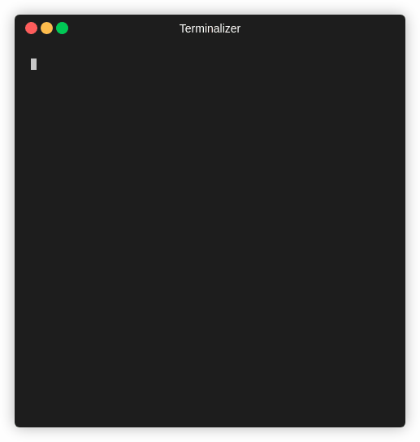

# 前言

Ciphey是一款自动化的解密和解码工具，它可以帮助用户快速识别和解密被加密的数据。Ciphey 使用一个带有密文检测接口(_Cipher Detection Interface_)的定制 AI 模型(_AuSearch_)来估测一个东西是用什么方式加密的。以及一个定制过的自然语言处理接口(_Language Checker Interface_)来检测给定文本何时变为纯文本。


# Docker安装和使用

## 安装Docker Engine

首先，需要安装Docker Engine。Docker Engine适用于Windows、macOS和Linux平台，通过Docker Desktop进行安装和管理。根据操作系统，选择相应的安装指南：

- [Docker Desktop for Linux](#)
- [Docker Desktop for Mac (macOS)](#)
- [Docker Desktop for Windows](#)

### 支持的平台

| 平台              | x86_64 / amd64 | arm64 / aarch64 | arm (32-bit) | ppc64le | s390x |
| --------------- | -------------- | --------------- | ------------ | ------- | ----- |
| CentOS          | ✅              | ✅               |              | ✅       |       |
| Debian          | ✅              | ✅               | ✅            | ✅       |       |
| Fedora          | ✅              | ✅               |              | ✅       |       |
| Raspberry Pi OS |                |                 | ✅            |         |       |
| RHEL            |                |                 |              |         | ✅     |
| SLES            |                |                 |              |         | ✅     |
| Ubuntu          | ✅              | ✅               | ✅            | ✅       | ✅     |

对于其他Linux发行版，Docker提供了二进制文件供手动安装。这些二进制文件是静态链接的，可以在任何Linux发行版上使用。

### 发布频道

Docker Engine有两种更新频道：稳定和测试：

- 稳定频道提供了已经发布的最新版本。
- 测试频道提供了准备好进行测试的预发布版本。

谨慎使用测试频道，预发布版本可能包括实验性的和早期访问的功能，这些功能可能会发生变化。

## 安装Ciphey

在安装了Docker Engine之后，可以使用Docker容器来安装和运行Ciphey。下面是创建和运行Ciphey Docker容器的步骤：

```bash
docker pull remnux/ciphey
```

## 使用Ciphey

```bash
docker run -it --rm remnux/ciphey "=MXazlHbh5WQgUmchdHbh1EIy9mZgQXarx2bvRFI4VnbpxEIBBiO4VnbNVkU"
```

# Docker的特性

- **支持 30+的加密方法** 例如编码（二进制，base64）和常规加密（例如 Caesar 密码，重复密钥 XOR 等）。 **[有关完整列表，请单击此处](https://github.com/Ciphey/Ciphey/wiki/Supported-Ciphers)**
- **具有增强搜索功能的定制人工智能（AuSearch）可以回答“使用了哪种加密技术?"** 解密时间不到 3 秒。
- **定制的自然语言处理系统** Ciphey 可以确定某些东西是否是纯文本。无论该纯文本是 JSON，CTF 标志还是英语 Ciphey，都可以在几毫秒内获得它。
- **多国语言支持** 目前，仅有德语和英语（带有 AU，UK，CAN，USA 变体）。
- **支持加密和哈希** 诸如 CyberChef Magic 之类的替代品则没有。
- **[C++ 核心](https://github.com/Ciphey/CipheyCore)** 这会使整个过程变得非常快。

# 贡献者

Ciphey 是由[Brandon](https://github.com/bee-san)在 2008 年发明的，并在 2019 年重写。

# 参考

[Ciphey/Ciphey: ⚡ Automatically decrypt encryptions without knowing the key or cipher, decode encodings, and crack hashes ⚡ (github.com)](https://github.com/Ciphey/Ciphey/tree/master)