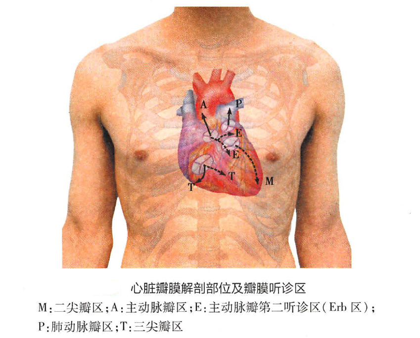
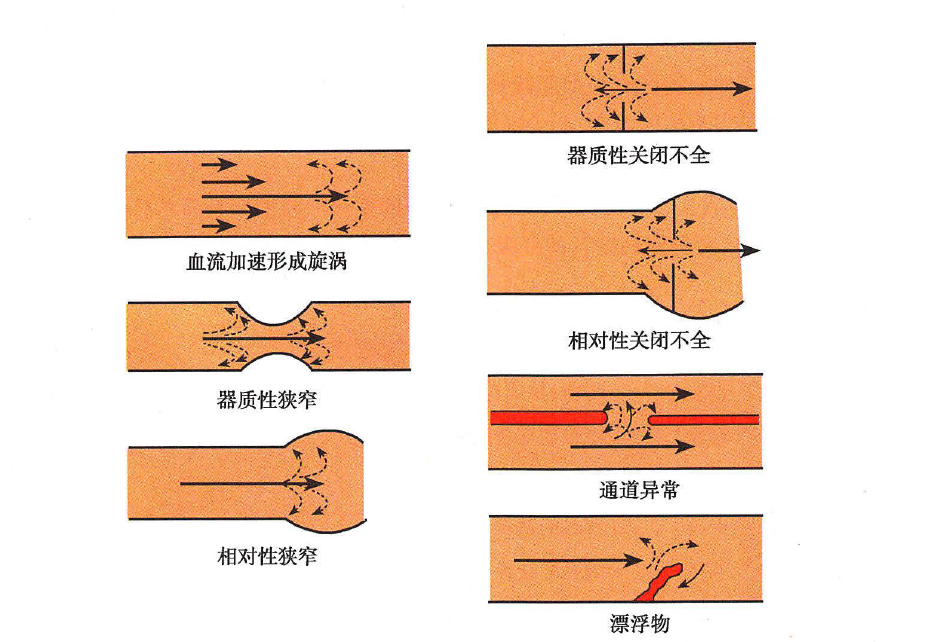

# 预备知识

## 听诊器选择

### 钟型体件

- **原理**：钟型体件的设计使其在轻轻放置于皮肤上时，通过空气柱振动来传导声音。这种设计使得它对**低频声音**更为敏感。
- **应用**：低频声音，如心脏二尖瓣舒张期的隆隆样杂音，通常是由血液较慢地通过心脏瓣膜移动时产生的。钟型体件能够更好地捕捉这种类型的声音，因为其结构对这种低频率的声波有更好的接收效果。

### 膜型体件

- **原理**：膜型体件通过一个紧绷的薄膜工作，由于膜的物理特性，它对**高频声音**更敏感。
- **应用**：高频声音，如主动脉瓣舒张期的叹气样杂音，通常由血液快速通过狭窄或不正常的瓣膜时产生。膜型体件通过其紧绷的膜能够过滤掉一部分低频声音，专注于捕捉这些高频声音。

## 心脏听诊区

### 瓣膜听诊位置

  <ul style="list-style-type: none;">
    <li><strong>二尖瓣区：</strong>位于心尖搏动最强点，又称心尖区。</li>
    <li><strong>肺动脉瓣区：</strong>在胸骨左缘第2肋间。</li>
    <li><strong>主动脉瓣区：</strong>在胸骨右缘第2肋间。</li>
    <li><strong>主动脉瓣第二听诊区：</strong>在胸骨左缘第3肋间。</li>
    <li><strong>三尖瓣区：</strong>在胸骨下端左缘，即胸骨左缘第4、5肋间。</li>
  </ul>

### 对瓣膜听诊位置和瓣膜实际位置不一致的解释

左心的射血速度较快，杂音往往传导，导致左心相关的两个瓣膜（二尖瓣和主动脉瓣）杂音听诊部位远离实际的瓣膜位置；右心的射血速度较慢，杂音会局限在实际瓣膜位置。

## 听诊顺序

通常的听诊顺序可以从心尖区开始，逆时针方向依次听诊： 先听心尖区再听肺动脉瓣区，然后为主动脉瓣区、主动脉瓣第二听诊区， 最后是三尖瓣区。一些临床医生也有从心底部开始依次进行各个瓣膜区的听诊。

<strong>心尖区➡️肺动脉瓣区➡️主动脉瓣区➡️主动脉瓣第二听诊区➡️三尖瓣区</strong>

## 听诊内容

### 心率

心动过速和心动过缓。

### 心律

各种心律不齐。

### 心音

#### 心音内容

  <ul style="list-style-type: none;">
    <li><strong>第一心音：</strong>房室瓣关闭音，音调低，响度高。</li>
    <li><strong>第二心音：</strong>动脉瓣关闭音，音调高，响度低。</li>
    <li><strong>第三心音：</strong>心室舒张早期，局限于心尖部或其内上方，仰卧位、呼气较清楚。</li>
    <li><strong>第四心音：</strong>心室舒张末期，收缩期前，心房收缩时；为病理音。</li>
  </ul>

#### 临床意义
##### 心音强度改变

<strong>S1强度改变（和心室前负荷紧密相关）</strong> 

<li>S1增强：二尖瓣狭窄（瓣膜活动好）。</li> 
<li>S1减弱：二尖瓣关闭不全、主动脉瓣关闭不全、P-R间期延长。</li>
<li>S1强弱不等：心房颤动、完全房室传导阻滞（可出现大炮音）。</li>

<strong>S2强度改变</strong> 

<li>S2增强：循环血量增多、高血压、肺动脉高压。</li> 
<li>S2减弱：循环血量减少、低血压、主动脉和肺动脉瓣膜狭窄。</li>

##### 心音性质改变

心肌严重病变时，第一心音失去原有性质且明显减弱，第二心音也弱， S1 、S2 极相似，可形成“单音律” 。当心率增快，收缩期与舒张期时限几乎相等时，听诊类似钟摆声，又称“钟摆律”或“胎心律”，提示病情严重，如大面积急性心肌梗死和重症心肌炎等。

##### 心音分裂

<strong>S2分裂</strong> 

<strong>生理性分裂：</strong>受呼吸影响
 

<strong>通常分裂（最常见）：</strong>受呼吸影响
 
<ul> 
<li>右室排血时间延长：二尖瓣狭窄伴肺动脉高压、肺动脉瓣狭窄等。</li> 
<li>左室射血时间缩短：如二尖瓣关闭不全、室间隔缺损等。</li> 
</ul> 

<strong>固定分裂：</strong>不受呼吸影响，见于先天性心脏病房间隔缺损。
 

<strong>反常分裂（逆分裂）：</strong>受呼吸影响，主动脉瓣关闭迟于肺动脉瓣，吸气时分裂变窄，呼气时变宽。
 <ul> 
<li>左心室机械活动：主动脉瓣狭窄，重度高血压。</li>
<li>左心室电活动：完全性左室传导阻滞。</li> 
</ul>

### 额外心音

#### 舒张期额外心音

##### 奔马律

<strong>舒张早期奔马律：</strong>

<strong>形成原因（心室舒张）：</strong>舒张早期奔马律是由于心室舒张期负荷过重，心肌张力减低与顺应性减退，以致心室舒张．血液充盈引起室壁振动。
 

<strong>病因：</strong>心力衰竭、急性心肌梗死、重症心肌炎与扩张性心肌病。
 

<strong>听诊部位：</strong>左室奔马律在心尖区稍内侧，呼气时较清楚；右室奔马律则在剑突下或胸骨左缘第5肋间，吸气时较清楚。
 

<strong>舒张晚期奔马律：</strong>

<strong>形成原因（心房收缩）：</strong>与心房收缩有关，是由于心室舒张末期压力增高或顺应性减退，以致心房为克服心室的充盈阻力而加强收缩所产生的异常心房音。

<strong>病因：</strong>高血压性心脏病、肥厚型心肌病、主动脉瓣狭窄。

<strong>听诊部位：</strong>心尖稍内侧。

 <strong>重叠型奔马律：</strong> 

<strong>形成原因：</strong>为舒张早期和晚期奔马律在快速性心率或房室传导时间延长时在舒张中期重叠出现引起，使此额外音明显增强。当心率较慢时，两种奔马律可没有重叠，则听诊为4个心音，称舒张期四音律。

<strong>病因：</strong>心肌病、心力衰竭。

##### 其他舒张期额外心音

###### 开瓣音

二尖瓣开放拍击声。听诊特点为音调高、历时短促而响亮、清脆，呈拍击样，在**心尖内侧**较清楚。开瓣音的存在可作为二尖瓣瓣叶弹性及活动尚好的间接指标，是二尖瓣分离术适应证的重要参考条件。

###### 心包叩击音

见于缩窄性心包炎，位于**胸骨左缘**。
###### 肿瘤扑落音

心房黏液瘤，位于心尖或其内侧**胸骨左缘第3 、4 肋间**。

#### 收缩期额外心音

##### 收缩早期喷射音

    <strong>形成原因：</strong>
    
扩大的肺动脉或主动脉在心室射血时<strong>动脉壁振动</strong>，以及在主、肺动脉阻力增高的情况下半月瓣瓣叶用力开启，或狭窄的瓣叶在开启时突然受限<strong>产生振动</strong>所致。

<strong>肺动脉收缩期喷射音</strong>

    <li><strong>心音变化：</strong>吸气时减弱，呼气时增强（吸气时肺组织扩张，肺血管相应扩容，肺循环血流量增大。右心室射血相对减少，喷射音减弱。反之，呼气时增强）。</li>
    <li><strong>听诊位置：</strong>肺动脉瓣区。</li>
    <li><strong>病因：</strong>肺动脉高压、原发性肺动脉扩张、轻中度肺动脉瓣狭窄、房间隔缺损、室间隔缺损。</li>

  <strong>注意</strong>
分析声音响度的时候，不能只看绝对的通过量，还要观察相对的通过量。

<strong>主动脉收缩期喷射音</strong>

    <li><strong>心音变化：</strong>不受呼吸影响。</li>
    <li><strong>听诊位置：</strong>主动脉瓣区听诊最响，可向心尖传导。</li>
    <li><strong>病因：</strong>肺动脉高压、原发性肺动脉扩张、轻中度肺动脉瓣狭窄、房间隔缺损、室间隔缺损。</li>

  <strong>额外心音和心脏杂音的鉴别</strong>
在血流加速、异常血流通道、血管管径异常改变等情况下，可使层流转变为湍流或旋涡而冲击心壁、大血管壁、瓣膜、脏索等使之振动而在相应部位产生杂音。相比较额外心音而言，影响部位更广，时限更长，不像心音或额外心音那样：短促、清脆。

##### 收缩中、晚期喀喇音

    <strong>形成原因：</strong>
    
房室瓣（多数为二尖瓣）在收缩中、晚期脱入左房，瓣叶突然紧张或其脏索的突然拉紧产生震动所致，这种情况临床上称为二尖瓣脱垂

    

     <strong>听诊位置：</strong>
    
心尖稍内侧。

    

    <strong>心音变化：</strong>
    
凡是增加外周阻力的，如握拳，蹲位可让心音延后产生，这是因为左心室射血变慢，心内压力增加较慢。

#### 医源性额外心音

##### 人工瓣膜音

##### 人工起搏音
### 心脏杂音

#### 体位、呼吸和运动对杂音的影响

##### 体位

    <strong>改变心脏和胸壁相对位置</strong>
    

    
<strong>左侧卧位</strong>可以让二尖瓣狭窄舒张中晚期隆隆样杂音增强。

<strong>前倾坐位</strong>可以闻及主动脉瓣关闭不全的叹气样杂音。

<strong>仰卧位</strong>让二尖瓣、三尖瓣和肺动脉瓣关闭不全的杂音增强。

    <strong>改变血液分布</strong>
    

    
如从卧位或下蹲位迅速站立，使瞬间回心血量减少，从而使二尖瓣、三尖瓣、主动脉瓣关闭不全及肺动脉瓣狭窄与关闭不全的杂音均减轻，而肥厚型梗阻性心肌病的杂音则增强。

  <ul style="list-style-type: none;">
  <strong>肥厚梗阻性心脏病

</strong>
    <li><strong>杂音增强：</strong>
    
心肌收缩力增强：正性肌力药、运动。

    
心脏前负荷降低：Valsalva动作、硝酸甘油、站立位。

    </li>
    <li><strong>杂音减弱：</strong>
    
心肌收缩力增强：负性肌力药。

    
增加心脏前负荷/后负荷：蹲位。
</li>
  </ul>

##### 呼吸

    
深吸气时，胸腔负压增加，回心血量增多和右心室排血量增加，从而使与右心相关的杂音增强，如三尖瓣或肺动脉瓣狭窄与关闭不全。

    
如深吸气后紧闭声门并用力作呼气动作(Valsalva动作），胸腔压力增高，回心血量减少，经瓣膜产生的杂音一般都减轻，而肥厚型梗阻性心肌病的杂音则增强。

##### 运动

#### 具体杂音分析

##### 收缩期杂音

###### 二尖瓣收缩期杂音

    <strong>功能性杂音</strong>
                

    
<strong>特性：</strong>柔和、吹风样、强度1～2级，时限短，较局限。

<strong>意义：</strong>甲亢、贫血等，可见于有左心增大引起的二尖瓣相对性关闭不全， 如高血压性心脏病、冠状动脉粥样硬化性心脏病、贫血性心脏病和扩张型心肌病等。

    <strong>器质性杂音</strong>
                

    
<strong>特性：</strong>吹风样、高调，强度＞3级，持续时间长，可占全收缩期，甚至遮盖S1 ，并向左腋下传导。

<strong>意义：</strong>风湿性心脏病二尖瓣关闭不全。

###### 主动脉瓣收缩期杂音

    <strong>功能性杂音</strong>
            

    
<strong>特性：</strong>杂音柔和，常有A2 亢进。

<strong>意义：</strong>见于升主动脉扩张，如高血压和主动脉硬化。

    <strong>器质性杂音</strong>
        

    
<strong>特性：</strong>典型的喷射性收缩中期杂音，响亮而粗糙，递增递减型， 向颈部传导，常伴有震颤，且A2减弱。

<strong>意义：</strong>主动脉瓣狭窄。

###### 肺动脉瓣收缩期杂音

    <strong>功能性杂音</strong>
    

    
<strong>特性：</strong>柔和、吹风样，强度在1～2级， 时限较短。

<strong>意义：</strong>为肺淤血及肺动脉高压导致肺动脉扩张产生的肺动脉瓣相对性狭窄的杂音。

    <strong>器质性杂音</strong>
        

    
<strong>特性：</strong>收缩中期杂音，喷射性、粗糙、强度≥3/6 级，常伴有震颤且P2 减弱。

<strong>意义：</strong>肺动脉瓣狭窄。

###### 三尖瓣收缩期杂音

    <strong>功能性杂音</strong>
    

    
<strong>特性：</strong>吹风样、柔和，吸气时增强，一般在3级以下。

<strong>意义：</strong>多见于右心室扩大的病人，如二尖瓣狭窄、肺源性心脏病，因右心室扩大
导致三尖瓣相对性关闭不全。

    <strong>器质性杂音</strong>
    

    
<strong>特性：</strong>可伴颈静脉和肝脏收缩期搏动。

<strong>意义：</strong>器质性三尖瓣关闭不全，极为少见。

##### 舒张期杂音

###### 二尖瓣舒张期杂音

    <strong>功能性杂音（Austin Flint 杂音）</strong>
    

    
<strong>形成原因：</strong>左室前负荷高，二尖瓣相对狭窄。

    
<strong>特性：</strong>注意和二尖瓣狭窄的器质性杂音鉴别。

    <strong>器质性杂音</strong>
    

    
<strong>特性：</strong>心尖S1亢进，局限于心尖区的舒张中、晚期低调、隆隆样、递增型杂音，平卧或左侧卧位易闻及，常伴震颤。

<strong>意义：</strong>风湿性心瓣膜病二尖瓣狭窄。

###### 主动脉瓣舒张期杂音

    <strong>器质性杂音</strong>
    
<strong>特性：</strong>杂音呈舒张早期开始的递减型柔和叹气样的特点，常向胸骨左缘及心尖传导，于主动脉瓣第二昕诊区、前倾坐位、深呼气后暂停呼吸最清楚。

<strong>意义：</strong>主动脉瓣关闭不全。

###### 肺动脉瓣舒张期杂音

    <strong>功能性杂音（Graham Steel杂音）</strong>
    
<strong>特性：</strong>杂音柔和、较局限、呈舒张期递减型、吹风样，于吸气末增强，常合并P2亢进。

<strong>意义：</strong>二尖瓣狭窄伴明显肺动脉高压。

###### 三尖瓣舒张期杂音

    
局限于胸骨左缘第4,5 肋间，低调隆隆样，深吸气末杂音增强，见于三尖瓣狭窄，极为少见。

  <ul style="list-style-type: none;">
  <strong>心脏杂音的递增和递减

</strong>
    <li><strong>二尖瓣狭窄</strong>
    
<strong>性质：</strong>舒张中、晚期递增的隆隆样杂音。

    
<strong>机制：</strong>舒张开始，心室内压急剧降低，抽吸作用增强；后面心室内压上升，但是充盈的血液让二尖瓣更加狭窄；此外，舒张晚期有心房收缩，让瓣膜通量更大，由此导致递增杂音。

    
<strong>例题：</strong>患者，女，27岁，风湿性心脏病二尖瓣狭窄、心房颤动。超声显示左房增大，二尖瓣瓣膜轻度肥厚，瓣口面积1.0cm²。心脏听诊不应该听到

    
A. 第一心音亢进

    
B. 开瓣音

    
C. 肺动脉瓣区收缩期杂音

    
D. 三尖瓣区收缩期吹风样杂音

    
<strong>E. 心尖部有收缩期前增强的杂音</strong>

    </li>
    

    <li><strong>二尖瓣关闭不全</strong>
	
<strong>性质：</strong>全收缩期一贯性杂音。

    
<strong>机制：</strong>和二尖瓣狭窄相反，收缩期开始血流反流，左房充盈后让二尖瓣关闭不全相对缓解。某种意义也是一种代偿。综合来看，收缩期杂音无太大变化。

        

    <li><strong>主动脉瓣狭窄</strong>
	
<strong>性质：</strong>收缩期递增递减性杂音。

    
<strong>机制：</strong>快速射血期主动脉内压低，室内压急剧上升；而减慢射血期主动脉内压虽然降低，不如室内压降低的快。综合来看为递增递减杂音。

            

    <li><strong>主动脉瓣关闭不全</strong>
	
<strong>性质：</strong>舒张期递减性杂音。

    
<strong>机制：</strong>主动脉内血液迅速流空，故递减杂音。

    
    
    </ul>
    

# 参考

1. 第九版《内科学》
2. 第九版《诊断学》
3. [教材竟然出了错？肥厚型心肌病的杂音问题你搞清楚了吗 - 丁香园 (dxy.cn)](https://heart.dxy.cn/article/655857)

