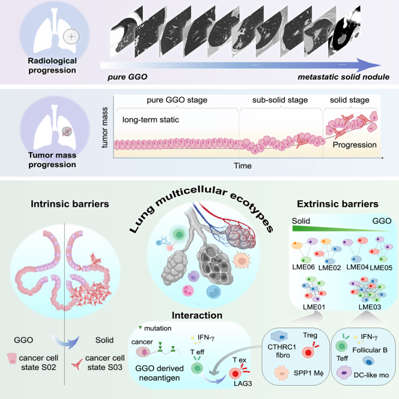

# 摘要

肺腺癌是一种具有多样临床表现和放射学特征的癌症，从磨玻璃样影（GGO）到纯实性结节，这些特征在生物学特性上存在显著差异。目前，我们对这种异质性的理解尚不充分。为了填补这一知识空白，我们利用机器学习、单细胞RNA测序（scRNA-seq）和全外显子测序技术，对58位肺腺癌患者进行了分析，发现了六种与特定放射学模式和癌细胞状态相关的肺多细胞生态类型（LME）。特别地，早期癌症中与GGO相关的新抗原能被CD8+ T细胞识别，显示出一个免疫活跃的环境；而实性结节则表现为具有免疫抑制作用的LME，其中CD8+ T细胞呈现耗竭状态，这一现象由特定基质细胞如CTHCR1+成纤维细胞所驱动。此外，本研究还发现GGO样本中的EGFR(L858R)新抗原可能触发CD8+ T细胞的激活。这些发现为理解肺腺癌的异质性提供了重要视角，并为早期疾病阶段的靶向治疗提供了新的思路。

# 生信方法

| 软件和算法                                | **链接**                                                                                                                                                                         | **用途**                        |
| ------------------------------------ | ------------------------------------------------------------------------------------------------------------------------------------------------------------------------------ | ----------------------------- |
| EcoTyper (v1.0)                      | [https://github.com/digitalcytometry/ecotyper](https://github.com/digitalcytometry/ecotyper)                                                                                   | 从大规模基因表达数据中识别细胞状态和细胞生态系统。     |
| CellRanger (v5.0.1)                  | [https://support.10xgenomics.com/single-cell-gene-expression/software/downloads/latest](https://support.10xgenomics.com/single-cell-gene-expression/software/downloads/latest) | 处理单细胞RNA测序数据，包括去混合、对齐和基因计数。   |
| GATK (v4.0.2.1)                      | [https://github.com/broadinstitute/gatk](https://github.com/broadinstitute/gatk)                                                                                               | 高通量测序数据中变异发现的工具。              |
| ANNOVAR (2017-07-17)                 | [https://annovar.openbioinformatics.org/en/latest/](https://annovar.openbioinformatics.org/en/latest/)                                                                         | 注释从各种基因组中检测到的遗传变异。            |
| ABSOLUTE R package (v1.0.6)          | [https://www.broadinstitute.org/scientific-community/software/absolute](https://www.broadinstitute.org/scientific-community/software/absolute)                                 | 确定绝对拷贝数变异和肿瘤纯度。               |
| Seurat R package (v3.1.0 and v4.0.0) | [https://github.com/satijalab/seurat](https://github.com/satijalab/seurat)                                                                                                     | 分析单细胞RNA测序数据，重点是聚类、可视化和跨条件整合。 |
| CopyKAT R package (v1.0.4)           | [https://github.com/navinlabcode/copykat](https://github.com/navinlabcode/copykat)                                                                                             | 在单细胞RNA测序数据中识别拷贝数变异。          |
| Monocle R package (v2.14.0)          | [https://github.com/cole-trapnell-lab/monocle-release](https://github.com/cole-trapnell-lab/monocle-release)                                                                   | 分析单细胞基因表达轨迹，用于研究细胞状态转换。       |
| CellChat R package (v1.0.0)          | [http://www.cellchat.org/](http://www.cellchat.org/)                                                                                                                           | 推断和分析单细胞RNA测序数据中的细胞间通信网络。     |
| Nichenetr R package (v1.0.0)         | [https://github.com/saeyslab/nichenetr](https://github.com/saeyslab/nichenetr)                                                                                                 | 预测相互作用细胞之间的配体-靶基因链接。          |
| MixCR (v4.0.0)                       | [https://github.com/milaboratory/mixcr/](https://github.com/milaboratory/mixcr/)                                                                                               | 分析T细胞受体和B细胞受体的序列数据。           |
| TCRAI (v0.1.1)                       | [https://github.com/regeneron-mpds/TCRAI/](https://github.com/regeneron-mpds/TCRAI/)                                                                                           | 分析T细胞受体测序数据，侧重于免疫库多样性和克隆性。    |
| TRUST4 (v1.0.4)                      | [https://github.com/liulab-dfci/TRUST4/](https://github.com/liulab-dfci/TRUST4/)                                                                                               | 从RNA测序数据中识别T细胞受体和B细胞受体序列。     |
| FragPipe (v19.1)                     | [https://www.nesvilab.org/software](https://www.nesvilab.org/software)                                                                                                         | 进行全面的蛋白质组数据分析，包括肽鉴定和定量。       |
| Infercnv (v1.13.0)                   | [https://github.com/broadinstitute/inferCNV](https://github.com/broadinstitute/inferCNV)                                                                                       | 从单细胞RNA测序数据中推断拷贝数变异。          |
| Customprodbj (v1.2.0)                | [https://github.com/wenbostar/Customprodbj](https://github.com/wenbostar/Customprodbj)                                                                                         | 为质谱数据分析定制蛋白基因组数据库。            |
| Pyclone (v0.13.1)                    | [https://github.com/Roth-Lab/pyclone](https://github.com/Roth-Lab/pyclone)                                                                                                     | 聚类并推断体细胞突变的细胞比例。              |

# 学术写作积累

1.      To reveal the multicellular ecotypes and distinct cell states present within both early-stage GGO lesions and advanced LUADs, we utilized EcoTyper, a **unified chassis** for scRNA-seq datasets（用于单细胞RNA测序数据集的统一框架）。

2.      Frameshift：移码突变；

3.      Synonymous：无义突变；

4.      We conducted droplet-based scRNA-seq using 10X Genomics on a total of 35 GGO samples from untreated patients and 14 solid nodule LUAD samples from **treatment-naive** patients（未经治疗）；

5.      **Mitogen**（丝裂原，常见词汇）-activated protein kinase (MAPK)；

6.      we observed that the majority of the residual disease group had low-to-undetectable levels of Epi S03 and higher fractions of Epi S02 compared to the treatment-naive and progressive disease patients：我们观察到，在**残留疾病组（治疗后仍然有残留）中，与未经治疗和疾病进展的患者相比，大多数患者的Epi S03水平较低或无法检测，而Epi S02的比例较高。

7.      cilium：纤毛、睫毛；

8.      major histocompatibility complex：MHC；

9.      We validated these scRNA-seq results by **interrogating** **（审查，查询）** our bulk RNA-seq of 76 biopsies from early-stage LUAD patients and observed similar trends of increased subpopulations of immune cells.

# 论述亮点

  
In a recently identified LCAM that promotes anti-tumoral response upon immunotherapy, CD138+IgG+ plasma cells were found to surround TLSs with dense aggregates of CXCL13+PD1+CD8+ T cells and CD20+ B cells as well as CD68+/SPP1+/FABP4− macrophages. However, in our GGO patient cohort, we observed that _MZB1_+ B cells (B S01) and _SPP1_+ macrophages (Mo/Mφ S03) were not forming an ecotype with CXCL13+CD8+ T cells. **Instead, they may be re-polarized by interacting with cancer-associated fibroblasts (CAFs) and mast cells.**
  

对癌生物学有很深入的了解。
执行力（建模、编码、推进）+理解力（解释实验结果、确定探索方向）。

  
Furthermore, due to the plasticity of monocyte-derived macrophages, the cell state of Mo/Mφ observed in LME01 may be polarized from other Mo/Mφ cell states present in another ecotype, highlighting the intercommunity interactions.
  

  
**The emergence of pro-exhausted CD8+ T cells** at the later stage of GGO progression prompted us to **explore whether the immune system could sense and detect GGO at an earlier phase.**
  

  
In addition, decreased diversity of T cell receptor (TCR) repertoires was observed upon the progression of LUAD, which is negatively correlated with CNVs. These observations suggested an increased intratumoral heterogeneity, which may be associated with decreased CD8+ T cytotoxicity at the later stage. 
  
CNV和抗肿瘤免疫环境是相反的？或许可以在免疫治疗中获益更多？

  
In our validation cohort, we did not detect the ITDFGRAK peptide in our HLA-class-I-associated immunopeptidome. However, we indeed detected the KITDFGRAK and VKITDFGRAK peptides in the tumors from two patients with GGO radiological features ([Figure 5](https://www.ncbi.nlm.nih.gov/pmc/articles/PMC11031428/figure/fig5/)H). These two patients also showed an HLA-A11.01 allele type, which is seemingly a dominant HLA allele type (>40%) in Asian individuals.[48](https://www.ncbi.nlm.nih.gov/pmc/articles/PMC11031428/#bib48) The distributions of HLA-A11.01 were also overrepresented in non-progressors as shown by another study. 
  
预后GWAS中很有可能会存在HLA区域的效应位点；由于HLA区域的SNP，即便有相同的肿瘤突变，最后的临床结局可能依然不同。

# 文章思路和感悟

1. 目标：描述GGO发展到腺癌的分子动力学景观。

2. 建模方法：传统思路是从DEG出发的，而本文则反其道而行之，根据全转录组鉴定细胞状态，并根据不同细胞和状态转录组表达的关联性，将细胞群组合为具有可解释表型信息的细胞“生态位”。以“生态位”为基础开展下面的分析，并逐层剖析每个生态位内部的分子生物学状态。**这样的处理思路最大化了局部的生物学信息，避免了从DEG开始的分析造成的局部偏倚。** 这一基本思想在GWAS富集分析方法scPagwas中也得到了体现（[Polygenic regression uncovers trait-relevant cellular contexts through pathway activation transformation of single-cell RNA sequencing data - ScienceDirect](https://www.sciencedirect.com/science/article/pii/S2666979X23001805)）。

3. 分析思路：首先对探究的问题进行建模，利用EcoTyper算法所构建的细胞状态、多细胞生态位作为全文分析的基础，并指出所分析样本包含的6个多细胞生态位。简单来说，肿瘤的组成是肿瘤细胞+肿瘤细胞相关微环境；
	1. 首先作者关注肿瘤细胞本身，研究了恶性细胞的细胞状态和相应表型特征，鉴定疾病进展或有进展潜能的特征细胞状态；在这里，作者确认**磨玻璃结节中会存在恶性细胞，恶性细胞的不同状态部分决定了疾病的进展**。
	2. **磨玻璃结节的转归不尽相同，虽然磨玻璃结节中有恶性细胞，且恶性细胞的不同状态部分决定疾病进展，但恶性细胞必须和周围环境相互作用才决定了最终的归宿**。所以，作者关注局部微环境的特征，鉴定疾病进展多细胞生态位的演化方向。在这个部分，作者使用朴素的基因注释和细胞通讯分析等方法，结合了临床情况，详细阐述了前面所定义的多细胞生态位内部的分子生物学事件。此外，文章还根据免疫细胞分化轨迹，精细刻画了不同生态位的演变过程。这里的论述，作者发现了**早期抗肿瘤免疫环境，晚期CD8耗竭**的典型免疫表型。这一独特现象促使作者考虑病变早期T细胞克隆的激活原因。
	3. 作者认为新抗原的产生以及被识别是早期T细胞克隆的产生原因。作者通过转录组数据推断CNV。CNV和新抗原产生成正比，CNV事件越多提示新抗原越多，肿瘤内部异质性越大，疾病更加进展，而TCR克隆反而减少。接着本文鉴定了TCR克隆激活的关键新抗原因素（突变）。
	4. 最后，作者进一步分析了耗竭表型的形成原因。

4. 感悟：在还原论和系统论中寻找认知事物的平衡。

# 引用

Deng Y, Xia L, Zhang J, et al. Multicellular ecotypes shape progression of lung adenocarcinoma from ground-glass opacity toward advanced stages. _Cell Rep Med_. 2024;5(4):101489. doi:10.1016/j.xcrm.2024.101489
