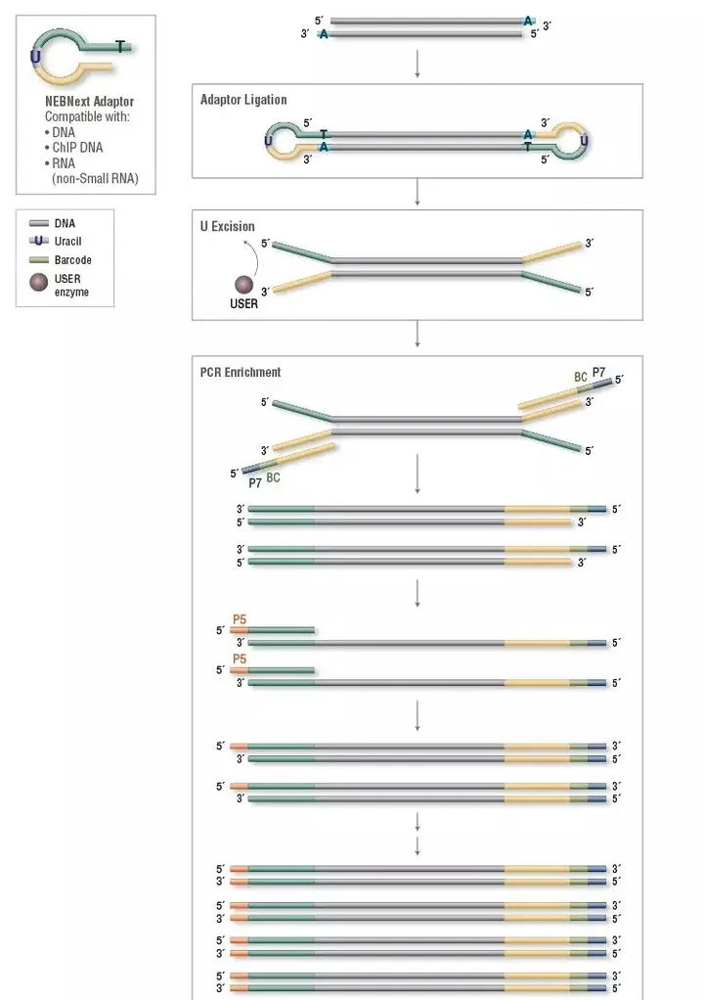
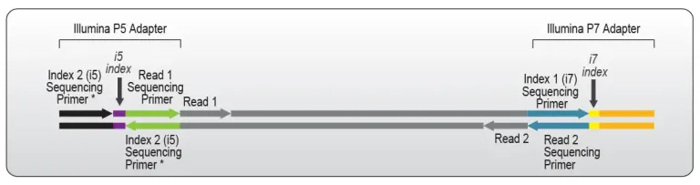
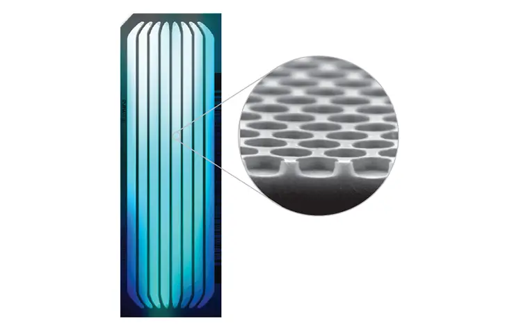
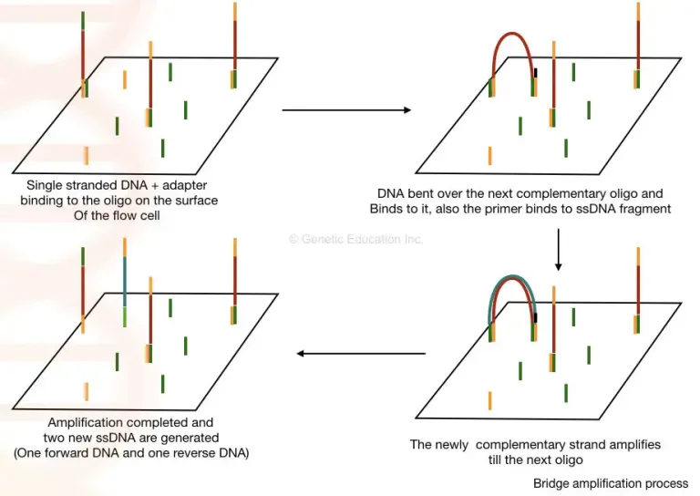

## 写在前面
&emsp;&emsp;**转录组**是特定组织或细胞在某一发育阶段或功能状态下转录出来的所有RNA的集合，包括编码蛋白质的mRNA和非编码RNA（non coding RNA, ncRNA）。**转录组测序**是指利用第二代高通量测序技术进行**cDNA**测序，全面快速地获取某一物种特定器官或组织在某一状态下的几乎所有转录本。

&emsp;&emsp;转录组分析的主要目标是：
1. 对所有的转录产物进行分类；
2. 确定基因的转录结构，如其起始位点，5′和3′末端，剪接模式和其他转录后修饰；
3. 量化各转录本在发育过程中和不同条件下(如生理/病理)表达水平的变化。

&emsp;&emsp;在更早的科学研究中，人们主要利用芯片杂交平台，预先设计基因探针从而完成测序。下一代测序（Next generation sequencing, NGS）的发展变革了测序方法，实现了单核苷酸水平的精准识别，人们不必预先设计探针，并能探索基因精细、稀有的转录结构。

## 基因芯片
&emsp;&emsp;虽然本文主要介绍RNA-seq这一技术，但实际上RNA-seq的目的和最终获得的数据格式与基因芯片有着相似之处，即都是以数据矩阵的形式呈现。因此，在介绍RNA-seq之前，我们有必要先了解一下基因芯片。
- **原理**：基于分子杂交技术，基因芯片主要依赖于印刷有荧光标记的探针来实现。例如，基因组芯片是一种常见的基因芯片类型，它集成了高密度的探针，具有高达几个碱基对到100个碱基对的分辨率。通过将样品与这些探针进行杂交，并使用荧光染料进行显色，可以揭示转录组的信息。这一原理与血浆cfDNA的测定方法非常相似（即使用**分光光度仪**）。
- **流程**：
	1. 标记mRNA或cDNA文库；
	2. 与设计好的探针相杂交；
	3. 洗脱之后，只有与探针特异性结合的cDNA得以保留；
	4. 成像系统拍照捕捉信息；
- **原始数据**：由仪器对杂交结果照像生成的图片，保存格式为CEL格式；
- **参考数据**：基因芯片探针排布的信息，保存为CDF格式；
- **优点**：高度集成，易于应用，成本低；
- **缺点**：  
    1. 高度地依赖已知信息；  
    2. 高背景噪音，非特异杂交会带来的**无法分辨弱信号**和**信号过饱和**的问题；  
    3. 在不同样品的比较当中，甚至在同一芯片内部，都存在杂交不均匀带来的各种问题，需要**标准化**等统计学方法来对结果校正；  
    4. 无法对可变剪接进行分析。
&emsp;&emsp;数据清洗和标准化我们会在后续章节进行阐述。

## NGS
&emsp;&emsp;NGS是一种高通量、高效率的基因组测序技术，它在基因组学和生物学研究中具有广泛的应用。下一代测序相对于传统的Sanger测序方法，具有更快速、更经济、更高通量的特点。
- **原理**：将待测DNA样本分离成小片段，并使用特定的方法进行扩增、捕获和测序。然后在高通量平台上进行并行测序，生成大量的序列片段。这些片段随后通过计算和分析，可以重构原始的DNA序列信息。
- **步骤**：
	1. 分离样本中的RNA，反转录为DNA；
	2. 样品制备：DNA样本需要被处理和准备成适合测序的库。这包括DNA提取、片段化和标记等步骤。
	4. 文库构建：将片段化的DNA样本连接到适当的测序适配器上，形成文库。适配器中包含了特定的序列，用于后续的扩增和测序。
	5. 扩增：将文库中的DNA片段进行扩增，通常采用PCR（聚合酶链式反应）方法。扩增后的文库可以包含成百上千万个DNA片段的复制。
	6. 测序：将扩增的文库加载到下一代测序仪中，进行高通量的并行测序。不同的下一代测序技术会使用不同的原理和方法，如Illumina的测序-by-synthesis技术、Ion Torrent的测序-by-detection技术等。
	7. 数据分析：通过计算和分析，将测序仪输出的原始数据转化为DNA序列信息。这包括图像处理、碱基识别、序列拼接、质量控制和变异检测等步骤。
- **步骤（细节）** ：
	1.  目前很多PCR使用的高保真Pfu聚合酶产生的片段末端是平齐的（即没有不配对的碱基）；鸟枪法产生的片段则是随机断裂，其末端可能是平齐的也可能是不平的，那么我们首先可以使用Taq聚合酶补齐不平的末端，在DNA双链的末端（3‘ 端），我们添加突出的A碱基，以为连接接头做准备（Adaptor）；
	2. 接头有突出的T，上述操作的DNA双链末端有突出的A，恰能配对。通过连接酶将接头连接上到DNA上；
	3. NEBNext接头是一个U碱基在中间的环形接头，连接上DNA后将U碱基删除，从而形成“Y形“末端；
	4. 接头添加的目的是作为引物实现这些序列的扩增：文库index（Barcode）、PCR引物Rd1 SP/Rd2 SP，以及和测序平台互补的寡核苷酸链扩增（P7、P5）【其中与P5端连接的Index称为Index 2，又称之为i5；与P7端连接的称为Index1，也称为i7】；
	5. Y形接头的设计，确保了DNA链两端是不配对的碱基序列引物，从而能够结合不同寡核苷酸序列，实现PCR中DNA链两端不会结合同一段序列（index、PCR引物以及和测序平台互补的寡核苷酸链），为后面的桥式扩增做准备；
	6. Illumina平台的测序技术为基于**基因芯片的边合成边测序**：在Illumina测序平台的流通池（Flow cell）表面（如下图），通过基因芯片技术交错固定了无数条分别文库接头中P5和P7互补的寡核苷酸链（即短核苷酸链），单链化的文库DNA片段进入流通池后，可以与表面的寡核苷酸结合，从而进入测序过程。
	7. 由于单链DNA的另一端具有不同的接头序列，因此它可以与相邻的另一种寡核苷酸互补配对，从而进行"桥"式扩增。假设第一次配对的接头是P7，一旦复制完成并洗脱模板后，DNA顶端可以与相邻的P5接头互补配对，形成一个"桥"结构。然后，以P5为引物进行复制。复制完成后，再次解链，并与相邻的不同种类接头结合，以进行下一轮复制。这个过程不断重复。25-28个循环完成后，原来散布在表面的核苷酸序列变成散布的DNA簇【何为散布的核苷酸序列？即一开始结合在P5或者P7上的序列】；
	8. 接着，再次解链线性化，切割并洗去连接在P5上的DNA链，只留下P7上的DNA单链【仅保留正向链，即一开始进入flowcell的模板链】；
	9. 边合成边测序技术：合成过程发出碱基特异荧光信号被捕捉，合成循环数决定读取长度，对于某一特定的DNA簇，相同的DNA链会被同时读取【为什么要用簇？是为了增强信号】。
	10. 接着测序index序列，从而提示样本来源；
	11. 我们接着进行模板链的另一端开始的测序，这一次也能同时完成index2的测序，双端测序有利于纠正首尾错配：步骤是再次桥式扩增（但一次循环就够了），然后如前测序；
	12. 测序完成，按照相同index进行分类，样本内具有相似base call的序列被聚类，正向和反向read被配为连续序列；
	13. 连续序列和参考基因组进行比对，确定基因和突变。

## 结语
&emsp;&emsp;对实验原理的透彻理解，是数据分析的基础。后续的归一化、标准化等数据清洗要求都是建立在实验原理上。

## 参考
1. [第二章：NGS原理解析01：二代测序流程 - 知乎 (zhihu.com)](https://zhuanlan.zhihu.com/p/282790878)
2. [干货 | Index这件小事，你get了吗？ - 知乎 (zhihu.com)](https://zhuanlan.zhihu.com/p/371040548#:~:text=Index%20%E5%8F%88%E7%A7%B0%20Barcode,%EF%BC%8C%E6%98%AF%E6%88%91%E4%BB%AC%E8%BF%9B%E8%A1%8C%20%E6%96%87%E5%BA%93%E6%B7%B7%E5%90%88%E6%B5%8B%E5%BA%8F%E6%97%B6%E7%94%A8%E4%BA%8E%E6%95%B0%E6%8D%AE%E6%8B%86%E5%88%86%E7%9A%84%E4%B8%80%E4%B8%AA%E6%A0%87%E7%AD%BE%20%EF%BC%8C%E5%85%B6%E4%B8%AD%E4%B8%8EP5%E7%AB%AF%E8%BF%9E%E6%8E%A5%E7%9A%84Index%E7%A7%B0%E4%B8%BAIndex%202%EF%BC%8C%E5%8F%88%E7%A7%B0%E4%B9%8B%E4%B8%BAi5%EF%BC%9B%E4%B8%8EP7%E7%AB%AF%E8%BF%9E%E6%8E%A5%E7%9A%84%E7%A7%B0%E4%B8%BAIndex1%EF%BC%8C%E4%B9%9F%E7%A7%B0%E4%B8%BAi7%E3%80%82)
3. [Next Generation Sequencing: Principle, Steps Involved, and Applications • Microbe Online](https://microbeonline.com/next-generation-sequencing/)
4. [Next-Generation Sequencing Illumina Workflow–4 Key Steps | Thermo Fisher Scientific - US](https://www.thermofisher.com/us/en/home/life-science/cloning/cloning-learning-center/invitrogen-school-of-molecular-biology/next-generation-sequencing/illumina-workflow.html)