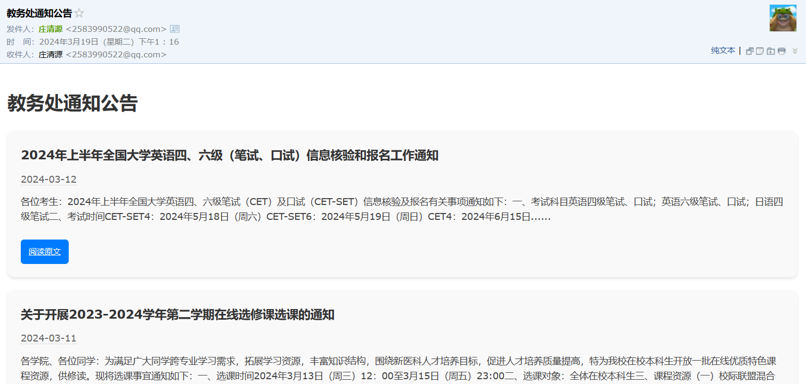

## 前言
&emsp;&emsp;在日常学习和工作中，及时获取学校教务处的最新通知非常重要。本文介绍了如何使用Python编写一个自动化脚本，该脚本能够爬取教务处网站的最新通知公告，并通过邮件发送给指定的收件人。这样，我们就可以在第一时间内获取到重要信息，不错过任何关键的通知或更新。
&emsp;&emsp;欢迎来给俺个星星✨！[ForrestGump618/Notification_NMU](https://github.com/ForrestGump618/Notification_NMU)。
## 技术栈

- **Python**：编程语言
- **requests**：HTTP库，用于发送网络请求
- **BeautifulSoup**：HTML解析库，用于解析网页内容
- **smtplib**、**email.mime.text**、**email.mime.multipart**：邮件发送库，用于构建和发送邮件

## 主要功能及实现步骤

### 1. 网页内容爬取（`scrape_website` 函数）

&emsp;&emsp;首先，定义`scrape_website(url)`函数，用于爬取教务处网站的通知公告列表。通过requests库发送GET请求获取网页内容，然后使用BeautifulSoup解析HTML，提取出通知公告的标题、链接和发布日期，最后将这些信息存储在列表中返回。

```python
def scrape_website(url):
    base_url = "https://jwc.njmu.edu.cn"
    page = requests.get(url)
    soup = BeautifulSoup(page.content, 'html.parser')
    items = soup.select('.news_list li')
    news_list = []
    for item in items:
        news = {}
        news_anchor = item.select_one('.news_title a')
        news['title'] = news_anchor.get('title').strip()
        news['link'] = base_url + news_anchor.get('href')
        news['date'] = item.select_one('.news_meta').text.strip()
        news_list.append(news)
    return news_list
```
### 2. 获取通知详细内容（`scrape_news_details` 函数）

&emsp;&emsp;定义`scrape_news_details(news_link)`函数，用于爬取每条通知的详细内容。同样使用requests和BeautifulSoup获取并解析页面，提取通知的正文内容，并生成一个简短的摘要返回。

```python
def scrape_news_details(news_link):
    page = requests.get(news_link)
    soup = BeautifulSoup(page.content, 'html.parser')
    content_element = soup.select_one('.wp_articlecontent')
    if content_element:
        content_text = content_element.get_text(separator=" ", strip=True)
        length = len(content_text)
        if length > 200:
            summary = content_text[:200] + " ......"
        else:
            summary = content_text
        return summary
    else:
        return "No content found."
```

### 3. 邮件发送（`send_email` 函数）

&emsp;&emsp;定义`send_email(subject, content, to_email)`函数，使用smtplib和email.mime相关模块构建并发送邮件。这里需要预先设置发件人邮箱、密码以及SMTP服务器信息。

```python
def send_email(subject, content, to_email):
    sender_email = "xxx"
    password = "xxx"
    msg = MIMEMultipart()
    msg['Subject'] = subject
    msg['From'] = sender_email
    msg['To'] = to_email
    msg.attach(MIMEText(content, 'html'))
    server = smtplib.SMTP_SSL('smtp.qq.com', 465)
    server.login(sender_email, password)
    server.send_message(msg)
    server.quit()
```
### 4. 主程序流程

&emsp;&emsp;在`if __name__ == "__main__":`块中，脚本首先调用`scrape_website`函数获取最新的通知列表，然后为每条通知生成HTML格式的邮件内容。如果当日有更新，则通过`send_email`函数将这些通知以邮件的形式发送给预设的收件人列表。

```python
if __name__ == "__main__":
    email_list = ["xxx"]
    url = 'https://jwc.njmu.edu.cn/842/list.htm'
    news_list = scrape_website(url)
    # 构建邮件内容省略，详见原始代码
    for email in email_list:
        if str(datetime.date.today()) in content_mail:
            send_email("今日有更新|教务处通知公告", content_mail, email)
        else:
            send_email("教务处通知公告", content_mail, email)
```
&emsp;&emsp;效果呈现如下：


### 5. 自动部署
&emsp;&emsp;利用批处理文件部署：
```bash
@echo off
C:  
cd C:\Users\Zhuang Qingyuan\Desktop\Notification
start python spyder.py
```
&emsp;&emsp;保存为BAT文件后，放到电脑的开始-菜单/启动文件夹下，即可开机启动。
## 使用指南

&emsp;&emsp;要使用这个脚本，你需要：

1. 安装Python及相关库（requests, BeautifulSoup4）。
2. 替换`sender_email`、`password`和`email_list`中的占位符为实际的邮箱地址和密码。
3. 运行脚本。脚本会自动检查教务处网站的更新，并将最新的通知发送到指定的邮箱中。

&emsp;&emsp;通过以上步骤，我们可以构建一个自动化的信息获取和提醒系统，帮助用户及时获取重要的教务通知，有效提升信息获取的效率和时效性。